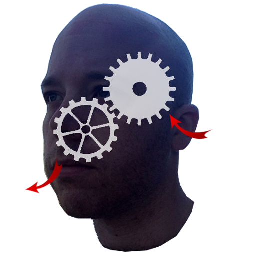

#The Brain

This is the various components of an Alexa app to take some notes.  What kind of notes you ask?  I don't know, what do you want to remember? That'd be a good thing to have Alexa remember.  Or write it down on paper.  But this comes with a timestamp which is kind of cool.

## Structure

The brain is backed by an elasticsearch database.  Notes go in based on Echo user id's, so the notes should be user specific.  And then you can search them back out using keywords.

## How does it work?

You: Alexa ask the brain
Alexa: What's up?
You: Remember that I turned off my hose
Alexa: I will remember that I turned off my hose

<later, the water company has overcharged you>

You: Alexa ask the brain to find hose
Alexa: I remember that I turned off my hose. Anything else?
You: What time was that?
Alexa: This note was recorded at November 26, 2016 at 1pm.
You: Send that to my phone.

<look at your phone>
Holy crap, its your note!  On your phone!  And the billing period started on November 25th! Evidence!! 

## Why did you make this?

I got totally screwed by the water company.  They claimed I used 10 swimming pools of water (which apparently costs about $2000) and apparently it was all through a hose that I had turned off one day into the month.  I can't prove that.  But if I could have taken a note with a timestamp, oh boy, I could have proven it!

Stupid water company.

Anyway, my loss is your gain.  Because I also got an Echo around the same time so I decided to make the note taking app that I wish I had in the past.  And yes, I record crap thats going on with my water.  Like, "Alexa ask the brain to remember that the water is brown.  Again."

## So wait, you have all of your code here, can't I make my own note taking app with it?

Sure.  

## I have some suggestions on how to make it better

Cool, make a pull request or whatever. I don't have tons of time to work on this but I'd be happy to make it more betterer.